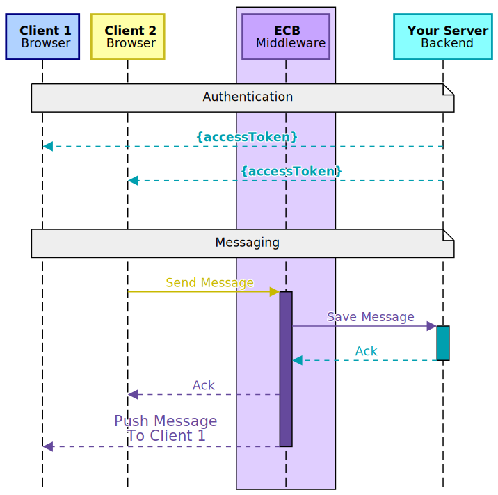

## Enterprise Chat Bridge (ECB)

# Introduction

- ECB is a middleware chat engine with **Push** to clients
- ECB is server **agnostic**, meaning that it can be deployed on any server/OS that runs <ins>Node.js</ins>
- ECB is highly **customizable** and can fit any chat scenario you need

It fits between your web server and your web application

## Technologies

### Your Server

Because ECB uses REST API only to communicate with your server, you can easily embed it to your existing solution such as <ins>ASP.NET</ins>, <ins>Node.js</ins>, <ins>PHP</ins> etc.

Alternatively, you can build a tiny backend server (a microservice) to communicate with ECB if you don't want to touch you existing server code or serving a static website.

### Your Client

 

ECB is built to work with browser clients (web). It uses Socket.IO, which is built atop WebSockets. Yet, if the browser doesn't support WebSockets, Socket.IO falls back to http hammed pull, while isolating your backend server from the workload, so it supports all browsers, modern and old.

## Integration Model

### Architecture

This is how it fits in your solution:

Your Web Clients <--> **ECB** <--> Your Backend Server

#### Authentication

1. Your server generates access token to each client
2. Client receives access token and uses it to connect to ECB (All client's communication henceforth is handled by ECB)

#### Messaging

1. Client 2 sends a message
2. ECB forwards the message to your server (for storage) and returns **ack**
3. ECB sends **ack** to Client 2
4. <ins>ECB **pushes** message to Client 1</ins>

## Security

ECB itself is sessionless, and does not requrie sessions on your server either. Instead, it uses JWT (JSON Web Tokens) for every connected user and for every thread.

### Keys

You will generate a new RS256 key pair:
Your server will store the **private key (secret)**, and use it to sign, verify and decode tokens.

**ECB** and your client will store the **public key** and use it to verify and decode token.

> Learn more about **ECB** authentication in ([Understanding ECB authentication](ECB-AUTHENTICATION.md)).

## How Does It Work?

**ECB** facilitates a number of operations that when you put together, you have a flixible, function-reach, and highly secured communication system.

The [Operations](ECB-OPERATIONS.md) document explains the details of every operation **ECB** offers in the natural flow of using it. We recommend that you go through it before proceeding.

## Integration Libraries

While you can implement your server and client from scratch, it's highly recommended to use our integration libraries; they are faster to integrate, and thoroughly tested.

### Server Adapters

#### ASP.NET (Nuget Package)

[https://www.nuget.org/packages/EnterpriseChatBridgeClient/](https://www.nuget.org/packages/EnterpriseChatBridgeClient/)

`nuget install EnterpriseChatBridgeAdapter`

#### NODE.JS / Express _with Typescript support_ (NPM Package)

[https://www.nuget.org/packages/EnterpriseChatBridgeClient/](https://www.nuget.org/packages/EnterpriseChatBridgeClient/)

`npm install ...............`

### Client Libraries

#### JavaScript _with Typescript support_ (NPM Package)

[https://www.npmjs.com/package/ecb-client-js](https://www.npmjs.com/package/ecb-client-js)

`npm install ecb-client-js`

## Implementation

Depending on how far you are in building your solution, integrating ECB should take anything between 4 and 16 hours.

1. **ECB:** Download, configure and start ECB
2. **Beckend Server:** Implement your ECB backend server
3. **Web Client:** Embed ECB client in your web application

### 1. ECB

[ECB Setup Documentation](ECB-SETUP-GUIDE.md)
...

## Usage Scenarios

**ECB** is designed with high-flexibility in mind. We want you to be able to use it in any scenario you might need.

### Example 1: Regular (Peer-to-Peer) Chat System

You have a collection of users. They are all connected as <ins>friends</ins> in your solution. Or they are all <ins>employees</ins> in your organization.

### Example 2: Customer Support

You have to classes of users, customer support <ins>agents</ins> and <ins>customers</ins>.

## Cross-browser Support

Socket.IO Browser support is tested in Saucelabs:

